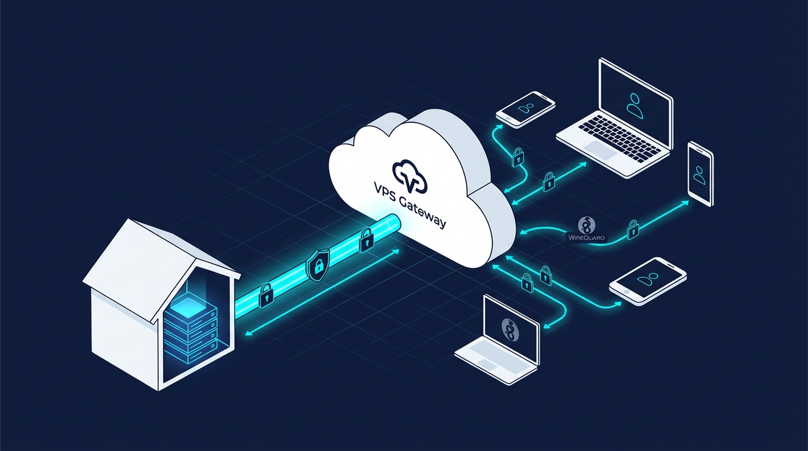

# CGNAT VPS Gateway



A **production-ready, open-source architecture** for exposing home servers behind CGNAT using a VPS gateway, a persistent WireGuard tunnel, Cloudflare as the security edge, and Traefik as a reverse proxy.

This repository documents a **clean, auditable alternative** to proprietary tunneling solutions — designed for self-hosters who want full control over their network edge.

---

## Who This Is For

This project is intended for:

- Self-hosters behind **ISP-imposed CGNAT**
- Homelab users with basic Docker and Linux knowledge
- Engineers who want **transparent networking**, not black-box tunnels
- Anyone running **public-facing services from home** securely

It is **not** a one-click solution.  
The explicitness is intentional.

---

## Problem Statement

Many ISPs place residential customers behind **Carrier-Grade NAT (CGNAT)**, meaning your home network shares a public IP address with hundreds of other customers. This makes it impossible to:

- Host publicly accessible services from home
- Open inbound ports for applications like Immich, Jellyfin, or Nextcloud
- Use traditional port forwarding or dynamic DNS solutions

This repository provides a **complete, auditable, and self-hosted solution** to bypass CGNAT **without opening a single inbound port on your home router**.

---

## Why This Architecture?

| Alternative | Why Not? |
|------------|----------|
| Cloudflare Tunnel | Proprietary, closed-source client. All traffic passes through Cloudflare-controlled tunnels with limited observability. |
| Tailscale | Depends on coordination servers and proprietary NAT traversal. Optimized for private meshes, not public services. |
| Zero Trust products | Vendor lock-in, opaque security models, complex pricing. |
| Direct VPN exposure | Requires exposing VPN ports directly to the internet, increasing attack surface. |

**This solution uses only open, auditable components:**

- **WireGuard** – modern, minimal, kernel-level VPN
- **Traefik** – battle-tested reverse proxy with declarative config
- **socat** – transparent, protocol-agnostic TCP forwarding
- **Cloudflare** – DNS, WAF, and TLS termination (free tier sufficient)

---

## Architecture

```
┌──────────┐ ┌─────────────┐ ┌──────────────────────────────┐ ┌─────────────────────────────────┐
│ │ │ │ │ VPS │ │ Home Server │
│ User │────▶│ Cloudflare │────▶│ ┌────────┐ ┌─────┐ │ │ │
│ │ │ (WAF, TLS) │ │ │Traefik │─▶│socat│ │ │ ┌─────┐ ┌───────────────┐ │
└──────────┘ └─────────────┘ │ └────────┘ └──┬──┘ │ │ │socat│───▶│ Application │ │
│ │ │ │ └──┬──┘ │ (e.g. Immich)│ │
│ ┌──────────────┴─────────┐ │ │ │ └───────────────┘ │
│ │ WireGuard │◀┼─────┼─────┘ │
│ │ 10.8.0.1 │ │ │ WireGuard 10.8.0.2 │
│ └────────────────────────┘ │ │ │
└──────────────────────────────┘ └─────────────────────────────────┘

```

---

## Traffic Flow

1. **User** requests `https://app.example.com`
2. **Cloudflare** terminates TLS (Full Strict), applies WAF rules
3. **Traefik** on VPS receives traffic on `:443`
4. **socat (VPS)** forwards TCP traffic into the WireGuard tunnel
5. **WireGuard** carries encrypted traffic to the home server
6. **socat (Home)** forwards traffic to the local application
7. **Application** responds through the same encrypted path

At no point is the home network directly reachable from the internet.

---

## Key Design Decisions

- **WireGuard initiated from home**  
  Outbound-only connection bypasses CGNAT entirely.

- **PersistentKeepalive = 25**  
  Prevents NAT mappings from expiring.

- **MTU = 1280**  
  Conservative value that avoids fragmentation in UDP tunnels.

- **socat double-bridge**  
  Explicit, protocol-agnostic forwarding with zero magic.

- **Cloudflare as sole entry point**  
  VPS firewall allows only Cloudflare IP ranges on `:443`.

---

## Security Model

### Defense in Depth

1. **Cloudflare**
   - WAF, rate limiting, bot filtering
   - TLS Full (Strict)
2. **VPS**
   - Minimal exposed surface
   - Firewall restricted to Cloudflare IPs
3. **WireGuard**
   - Authenticated, encrypted tunnel
   - Public-key cryptography only
4. **Home Server**
   - No inbound ports
   - No public IP exposure

---

## Cost Overview

| Component | Cost |
|---------|------|
| VPS (1 vCPU, 1 GB RAM) | ~4–5 €/month |
| Cloudflare | Free tier |
| Domain | ~10–15 €/year |
| **Total** | **~5–6 €/month** |

---

## VPS Provider Recommendation (Hetzner)

This setup was developed and tested primarily on **Hetzner Cloud**, which offers:

- Reliable networking
- Excellent price/performance
- Simple firewall configuration
- Data centers in the EU

If you do not yet have a VPS provider, you can use the following **referral link**:

👉 **<https://hetzner.cloud/?ref=1vpirtDtm8YQ>**

Using this link gives you **free starting credit** and helps support continued maintenance of this project.  
You are **not required** to use Hetzner — any VPS with a public IP will work.

---

## Supported Use Cases

- Media servers (Jellyfin, Plex)
- Photo management (Immich, PhotoPrism)
- File sync (Nextcloud)
- Home automation dashboards
- Development and internal tools
- Any TCP-based application

---

## Quick Start

> ⚠️ This repository is intentionally explicit and **not plug-and-play**.  
> Read the documentation carefully before deploying.

High-level steps:

1. Deploy VPS services
2. Establish WireGuard tunnel
3. Deploy home server bridge
4. Configure Cloudflare DNS and WAF

Detailed instructions are provided in the `vps/` and `home-server/` directories.

---

## Disclaimer

> **These are reference configurations.**

You must:

- Generate your own keys
- Replace all placeholder values
- Configure firewalls correctly
- Test before production use

This repository prioritizes **clarity and control over convenience**.

---

## License

MIT License — see [LICENSE](LICENSE).
